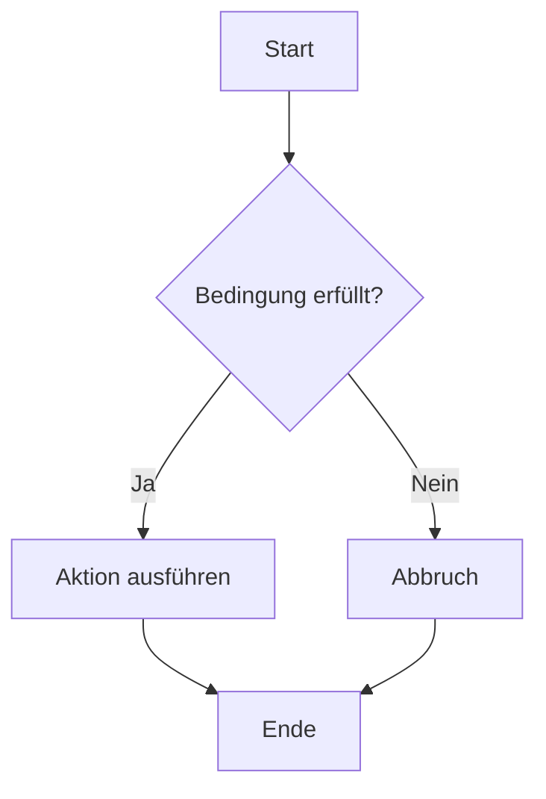

# Hello GitHub

Das ist mein GitHub Workshop Beispiel

```mermaid
graph TD
    A[Start] --> B{Bedingung erfüllt?}
    B -->|Ja| C[Aktion ausführen]
    B -->|Nein| D[Abbruch]
    C --> E[Ende]
    D --> E
```
