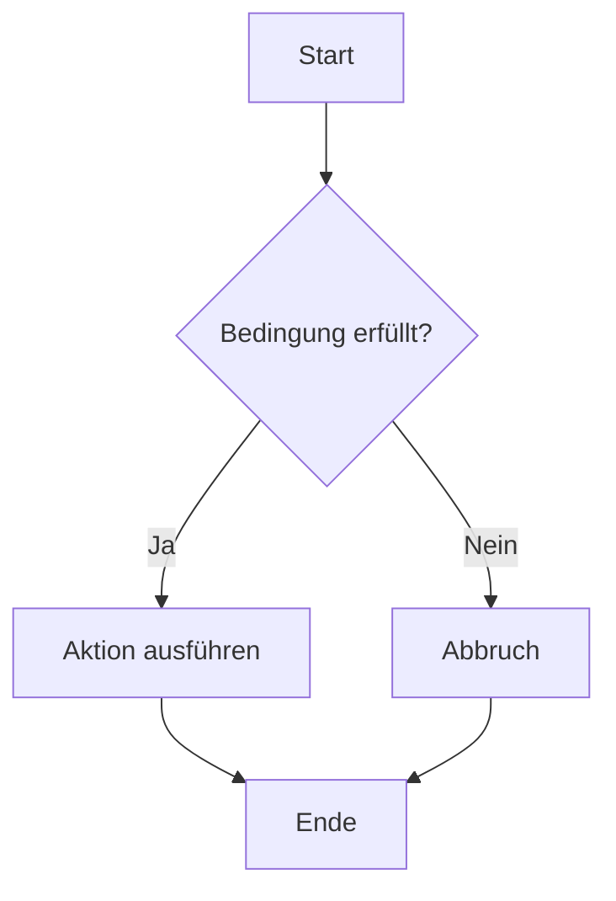

# Hello GitHub

[🐞 Bug melden](https://github.com/GregorBiswanger/t-800-hello-github/issues/new?template=bug_report.md)
[🐞 Bug melden](https://github.com/GregorBiswanger/t-800-hello-github/issues/new?template=bug_report.md&labels=bug&title=Fehler%20gefunden)

Das ist mein GitHub Workshop Beispiel

